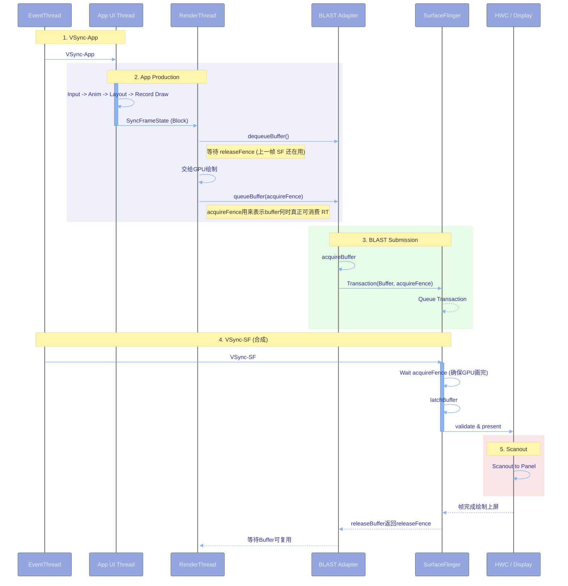

### 1.1 buffer：一帧像素数据的容器

Buffer就是一块内存，里面存着一张图像的像素。是一块**矩形像素数据**。宽、高、像素格式（RGBA_8888等）、stride（每行多少字节）是它的基本属性。

关键：SurfaceFlinger处理的是一块块buffer。窗口是Java层的抽象，到SurfaceFlinger这一层只剩下buffer，要放在屏幕的什么位置、什么层级

### 1.2 GraphicBuffer：带元数据的buffer封装

`GraphicBuffer`是buffer的对象化封装，除像素内存外还带：

| 属性 | 含义 |
|---|---|
| 宽高与格式 | 尺寸和像素格式 |
| usage | 用途标志（CPU读写、GPU纹理、HWC直接扫描等），决定分配时用什么内存 |
| 句柄（native_handle） | 跨进程共享这块内存的凭据 |
| 分配器来源 | gralloc分配的图形内存 |

判据：**GraphicBuffer能在进程间传递，传的不是像素本身，而是"共享内存句柄+元数据"。** 所以app画完的buffer交给SurfaceFlinger时并没有拷贝像素，双方映射的是同一块物理内存。

### 1.3 BufferQueue：生产者—消费者队列（老Android版本,Android 12以前）

`BufferQueue`是buffer在"生产方"和"消费方"之间传递的通道，是一个**固定槽位数**的循环队列，由SurfaceFlinger管理。

**生产者（Producer）**：往里放画好的buffer的一方。app通过`Surface`（`BufferQueueProducer`）放。这里的surface本质是拥有生产者端Binder对象（IGraphicBufferProducer）的一个代理，app获取buffer实际上要通过binder向SurfaceFlinger跨进程通信
**消费者（Consumer）**：从里取buffer的一方。SurfaceFlinger通过`BufferQueueConsumer`取。BufferQueue本身就是由Surfaceflinger管理的，不涉及IPC

**BufferQueueCore**：队列的核心数据结构，持有：

| 成员 | 作用 |
|---|---|
| `mSlots` | 槽位数组，固定`NUM_BUFFER_SLOTS`个 |
| `mQueue` | 已入队、待消费的buffer的FIFO队列 |
| `mFreeSlots` | 空闲槽位集合 |
| `mActiveBuffers` | 已分配内存、正在使用的槽位集合 |
| `mMaxDequeuedBufferCount` | 生产者最多能同时持有的buffer数 |
| `mMaxAcquiredBufferCount` | 消费者最多能同时持有的buffer数 |

多槽位：消费方还在显示第N帧时，生产方已经在画第N+1帧。槽位数就是这个流水线的深度。槽位不够时生产者会阻塞等待

### 1.4 BufferSlot状态

buffer中每个槽位在任意时刻处于五态之一，`mDequeueCount`/`mQueueCount`/`mAcquireCount`三个计数器和`mShared`标志决定状态：

| 状态 | mShared | mDequeueCount | mQueueCount | mAcquireCount | 谁拥有 | 含义 |
|---|---|---|---|---|---|---|
| FREE | false | 0 | 0 | 0 | BufferQueue | 空闲，可被生产者dequeue |
| DEQUEUED | false | 1 | 0 | 0 | 生产者 | 生产者已取出，正在画 |
| QUEUED | false | 0 | 1 | 0 | BufferQueue | 生产者画完入队，待消费 |
| ACQUIRED | false | 0 | 0 | 1 | 消费者 | 消费者已取走，正在用 |
| SHARED | true | 任意 | 任意 | 任意 | 共享 | 共享buffer模式，可同时处于上述任意组合 |

状态迁移：
```
         dequeueBuffer            queueBuffer              acquireBuffer
FREE ──────────────────→ DEQUEUED ──────────────→ QUEUED ──────────────→ ACQUIRED
  ↑                          │                                              │
  └──────────────────────────┘                                              │
        cancelBuffer / detachBuffer                                         │
  ↑                                                                         │
  └─────────────────────────────────────────────────────────────────────────┘
                          releaseBuffer
```

FREE归队列、DEQUEUED归生产者、QUEUED归队列（等待）、ACQUIRED归消费者。出现"buffer不够用"的卡顿时，本质是某个状态下的槽位被占满、下一环拿不到槽位。

### 1.5 Fence：GPU与显示的同步

一个buffer画完了这件事，CPU并不知道确切时刻，绘制命令是发给GPU异步执行的。**Fence就是GPU完成工作的通知机制**：一个文件描述符，可以被等待（wait），信号到来即表示对应的GPU操作已完成。

三种关键fence：

| Fence | 谁产生 | 谁等待 | 含义 |
|---|---|---|---|
| acquire fence | 生产者 | 消费者 | 这块buffer还在写，等到这个信号再读 |
| release fence | 消费者 | 生产者 | 这块buffer用完了，可以重新写了 |
| present fence | HWC | SurfaceFlinger | 这一帧已经真正显示在屏幕上了 |

**buffer的传递永远伴随fence传递** 生产者`queueBuffer`时必须带上acquire fence，消费者拿到buffer后必须等这个fence信号才能读——这样生产者和消费者才能真并行，各自不必空等。

### 1.6 Surface与SurfaceControl（有了BlastBufferQueue后的视角）

Surface（应用侧/生产者）：由应用进程持有，是生产图形缓冲的入口。应用向Surface生产内容，它的核心职责是dequeueBuffer和queueBuffer
SurfaceControl（系统侧/控制者）：由WindowManagerService持有，负责定义layer在屏幕上的位置、层级（Z-order）、裁剪区域、透明度、变换（缩放/旋转）等元数据

有了BBQ之后，将缓冲的提交（surface）与图层属性的变更（SurfaceControl）打包成原子事务一起提交，解决了画面与窗口位置不同步的撕裂或错位问题

APP端拿到的Surface，它持有的Native层的Surface：
```java
// frameworks/base/core/java/android/view/Surface.java
public final class Surface implements Parcelable, AutoCloseable {
    private long mNativeObject;  // 指向 Native Surface 的指针
    private final Object mLock = new Object();
    // ...
}
```
Surface中dequeueBuffer和queueBuffer最终都是落到了自己的mGraphicBufferProducer上
参考以下列表构造：
Surface::Surface(const sp<IGraphicBufferProducer>& bufferProducer): mGraphicBufferProducer(bufferProducer)


### 1.7 Layer：SurfaceFlinger里的合成单元

`Layer`是SurfaceFlinger内部代表一个可合成对象的类。一个Layer对应客户端的一个SurfaceControl，最终对应屏幕上的一个视觉图层
surface写入的buffer，surfacecontrol改变的图层属性最终都会落到surfaceflinger的一个layer

Layer持有的关键信息：

| 信息 | 含义 |
|---|---|
| buffer | 当前要合成的那块像素数据 |
| 几何 | 位置、大小、裁剪、变换矩阵 |
| z序 | 在Layer树中的绘制顺序 |
| 可见性 | 是否显示、透明度 |
| 混合参数 | 颜色变换、混合模式 |
| 所属输出 | 在哪个屏上显示 |

## 2 BlastBufferQueue: 新的（APP与WMS）与SurfaceFlinger之间的桥接工具

### 2.1.创建流程

传统BufferQueue：由SurfaceFlinger创建和管理
BlastBufferQueue：由App端（ViewRootImpl）创建和管理   （根据源码可以看到路径是VRI->创建surfacecontrol->创建BlastBufferQueue->创建surface）

```java
// frameworks/base/core/java/android/view/ViewRootImpl.java
private int relayoutWindow(WindowManager.LayoutParams params, int viewVisibility, boolean insetsPending) throws RemoteException {
    ...
    // 通过Binder向WMS请求，这里传入mSurfaceControl，最后其实是mSurfaceControl内部状态被更新了
    relayoutResult |= mWindowSession.relayout(mWindow, params,
            requestedWidth, requestedHeight, viewVisibility,
            insetsPending ? WindowManagerGlobal.RELAYOUT_INSETS_PENDING : 0,
            mRelayoutSeq, seqId, mRelayoutResult, mSurfaceControl);
    ...
    if (mSurfaceControl.isValid()) {
        // updateRenderTargetIfNeededd()最后调到updateBlastSurfaceIfNeeded()
        updateRenderTargetIfNeeded();
        if (mAttachInfo.mThreadedRenderer != null) {
            updateRendererSurfaceControlAndBbq(mSurfaceControl, mBlastBufferQueue);
        }
        mHdrRenderState.forceUpdateHdrSdrRatio();
        if (transformHintChanged) {
            dispatchTransformHintChanged(transformHint);
        }
    }
    ...
}
```

进入WMS的处理逻辑，在这里面会完成SurfaceControl，以及SurfaceFlinger中Layer的创建
```java
// frameworks/base/services/core/java/com/android/server/wm/Session.java
public int relayout(IWindow window, WindowManager.LayoutParams attrs,
        int requestedWidth, int requestedHeight, int viewFlags, int flags, int seq,
        int syncSeqId, WindowRelayoutResult outRelayoutResult, SurfaceControl outSurface) {
    Trace.traceBegin(TRACE_TAG_WINDOW_MANAGER, mRelayoutTag);
    // 这里进入WMS
    int res = mService.relayoutWindow(this, window, attrs, requestedWidth,
            requestedHeight, viewFlags, flags, seq, syncSeqId, outRelayoutResult, outSurface);
    Trace.traceEnd(TRACE_TAG_WINDOW_MANAGER);
    return res;
}

// frameworks/base/services/core/java/com/android/server/wm/WindowManagerService.java
public int relayoutWindow(Session session, IWindow client, LayoutParams attrs,
            int requestedWidth, int requestedHeight, int viewVisibility, int flags, int seq,
            int syncSeqId, WindowRelayoutResult outRelayoutResult,
            SurfaceControl outSurfaceControl) {
    ...
    // 这里省略其他判断逻辑
    result = createSurfaceControl(outSurfaceControl, result, win, winAnimator);
    ...
}

private int createSurfaceControl(SurfaceControl outSurfaceControl, int result, WindowState win, WindowStateAnimator winAnimator) {
    ...
    surfaceControl = winAnimator.createSurfaceLocked();
    if (surfaceControl != null) {
        // 创建完成后进行copy
        winAnimator.getSurfaceControl(outSurfaceControl);
        // void getSurfaceControl(SurfaceControl outSurfaceControl) {
        //     outSurfaceControl.copyFrom(mSurfaceControl, "WindowStateAnimator.getSurfaceControl");
        // }
        ProtoLog.i(WM_SHOW_TRANSACTIONS, "OUT SURFACE %s: copied", outSurfaceControl);
    }
    ...
}

// frameworks/base/services/core/java/com/android/server/wm/WindowStateAnimator.java
SurfaceControl createSurfaceLocked() {
    ...
    mSurfaceControl = mWin.makeSurface()
                    .setParent(mWin.mSurfaceControl)
                    .setName(mTitle)
                    .setFormat(format)
                    .setFlags(flags)
                    .setMetadata(METADATA_WINDOW_TYPE, attrs.type)
                    .setMetadata(METADATA_OWNER_UID, mSession.mUid)
                    .setMetadata(METADATA_OWNER_PID, mSession.mPid)
                    .setCallsite("WindowSurfaceController")
                    .setBLASTLayer().build();
    ...
}

// frameworks/base/core/java/android/view/SurfaceControl.java
public SurfaceControl build() {
    ...
    return new SurfaceControl(
            mSession, mName, mWidth, mHeight, mFormat, mFlags, mParent, mMetadata,
            mLocalOwnerView, mCallsite);
}
private SurfaceControl(SurfaceSession session, String name, int w, int h, int format, int flags,
            SurfaceControl parent, SparseIntArray metadata, WeakReference<View> localOwnerView,
            String callsite) throws OutOfResourcesException, IllegalArgumentException {
    ...
    // 通过JNI创建
    nativeObject = nativeCreate(session, name, w, h, format, flags, parent != null ? parent.mNativeObject : 0, metaParcel);
    ...
    assignNativeObject(nativeObject, callsite);
}
```

后续代码不做深入，整体逻辑是在nativeCreate中通过SurfaceFlinger的Proxy去创建了SurfaceControl(CPP)，并在创建SurfaceControl(CPP)的过程中，创建了Layer，通过handle把Layer与SurfaceControl(CPP)绑定，最终返回给WMS一个SurfaceControl(Java)，WMS中将创建好的SurfaceControl(Java)通过Copy给到VRI的mSurfaceControl

到这里还没有看到BlastBufferQueue，其实是VRI通过`mSurfaceControl.isValid()`判断SurfaceControl(CPP)对象已经创建完成后再开始BlastBufferQueue的创建
```java
void updateRenderTargetIfNeeded() {
    if (!mSurfaceControl.isValid()) {
        return;
    }
    if (mAttachInfo.mThreadedRenderer != null) {
        mAttachInfo.mThreadedRenderer.updateRenderTargetSize(mSurfaceSize.x, mSurfaceSize.y);
    }
    if (!mIpcRenderingEnabled) {
        updateBlastSurfaceIfxNeeded();
    }
    mRenderTargetIsValid = true;
}
void updateBlastSurfaceIfNeeded() {
    // 可复用就直接复用已有的BlastBufferQueue
    if (mBlastBufferQueue != null && mBlastBufferQueue.isSameSurfaceControl(mSurfaceControl)) {
        mBlastBufferQueue.update(mSurfaceControl, mSurfaceSize.x, mSurfaceSize.y, mWindowAttributes.format);
        return;
    }
    // 重建新的BlastBufferQueue
    if (mBlastBufferQueue != null) {
        mBlastBufferQueue.destroy();
    }
    mBlastBufferQueue = new BLASTBufferQueue(mTag, true);
    mBlastBufferQueue.setApplyToken(mBbqApplyToken);
    mBlastBufferQueue.update(mSurfaceControl, mSurfaceSize.x, mSurfaceSize.y, mWindowAttributes.format);
    mBlastBufferQueue.setTransactionHangCallback(sTransactionHangCallback);
    Surface blastSurface;
    // 这里返回了包含IGraphicBufferProducer接口和携带了底层SurfaceControl的句柄的surface
    blastSurface = mBlastBufferQueue.createSurfaceWithHandle();
    mSurface.transferFrom(blastSurface);
    mTransaction.setRecoverableFromBufferStuffing(mSurfaceControl).applyAsyncUnsafe();
}
```

### 2.2 BlastBufferQueue下的缓冲区获取机制

通过2.1BlastBufferQueue的创建流程可以看出BlastBufferQueue是由APP端创建并管理的

在之前的传统BufferQueue中，RenderThread需要通过Binder调用向SurfaceFlinger请求Buffer，可能会因为没有可用Buffer而阻塞

而通过BlastBufferQueue：在App端预先管理缓冲区池，RenderThread可以更高效地获取Buffer（也会阻塞）

当App需要进行UI绘制的时候，只需要通过Surface的IGraphicBufferProducer(IGBP)从BLASTBufferQueue中申请一块GraphicBuffer，如果BLASTBufferQueue中没有可用的内存，那么就会通过Gralloc分配一块Buffer，然后把App把UI绘制到这一块GraphicBuffer中，最后由BLASTBufferQueue提交给SurfaceFlinger去做进一步合成


## 3.BlastBufferQueue下buffer的使用

要明确的一点是，BlastBufferQueue并不是一个全新的BufferQueue，之前使用的BufferQueue仍然保留，其核心使用逻辑并没有变，只是从由SurfaceFlinger管理BufferQueue，变成了应用进程管理BlastBufferQueue

### 3.1 buffer正常使用流程

| 步骤 | 调用者 | 动作 | 槽位状态变化 |
|---|---|---|---|
| 1 | 生产者（app） | `dequeueBuffer` 取一个空闲槽位 | FREE → DEQUEUED |
| 2 | 生产者 | 往buffer里画内容（GPU渲染） | DEQUEUED |
| 3 | 生产者 | `queueBuffer` 入队 | DEQUEUED → QUEUED |
| 4 | 消费者（BBQ） | BBQ自己`acquireBuffer` 消费 | QUEUED → ACQUIRED |
| 5 | BBQ | BBQ`setBuffer()`给SurfaceFlinger | ACQUIRED |
| 5 | 消费者 | SurfaceFlinger用完，`releaseBuffer` 归还，给release fence | ACQUIRED → FREE |

### 3.2 每一步的实质

**`dequeueBuffer`**：从`mFreeSlots`或可重用的`mActiveBuffers`里挑一个槽位返回给生产者。如果槽位都用完了，生产者在这里**阻塞等待**。

**`queueBuffer`**：把槽位放进`mQueue`（FIFO），同时带上acquire fence，画完了，但GPU可能还在写入，等待这个信号。

**`acquireBuffer`**：SurfaceFlinger从`mQueue`取出一个buffer。取出后**不能立刻读**，必须等acquire fence信号。

**`releaseBuffer`**：SurfaceFlinger用完（合成完、显示完）后归还槽位，同时给release fence，用完了，可以重写这块内存了。生产者在下次`dequeueBuffer`拿到这个槽位时，要等release fence才能写。

判据：**整个往返中，槽位的所有权在队列、生产者、消费者之间来回转移，而fence保证了转移过程中没有人读到正在被写的数据。** 

